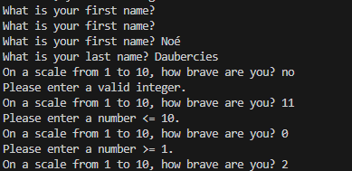
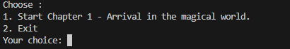
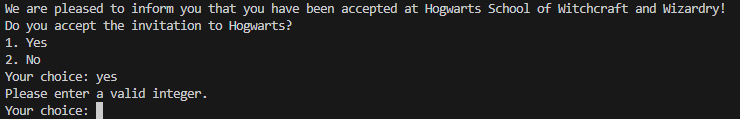

# Hogwarts-Daubercies-Demerin-INT2

## 1. General Presentation

**Project Title:** Hogwarts Interactive Adventure Game

**Brief Description:**
An immersive Python-based interactive game where players create a character and embark on a magical journey through four chapters in the Hogwarts universe. Players can choose their house, learn spells, manage inventory, participate in Quidditch, and make choices that affect their gameplay experience.

**Contributors:**
- Daubercies
- Demerin

### Installation

**Instructions for cloning the Git repository:**
```bash
git clone https://github.com/your-username/hogwarts-Daubercies-Demerin-INT2.git
cd hogwarts-Daubercies-Demerin-INT2
```

**Steps to configure the development environment:**
No additional packages are required. The application uses only Python's standard library with Python 3.7 or higher.

### Usage

**Instructions on how to run the application:**
```bash
python hogwarts/main.py
```

**Examples of use cases:**
1. Create a new character and progress through Chapter 1: "Arrival in the magical world"
2. Navigate through chapters 2, 3, and 4 by making choices that affect your character
3. Manage your character's inventory, spells, and magical coins throughout the game
4. Participate in house competitions and magical quizzes
5. View your final character statistics and achievements

**Key Features:**
- Character creation with customizable attributes
- House sorting system (Gryffindor, Hufflepuff, Ravenclaw, Slytherin)
- Four progressive chapters with interactive storytelling
- Spell learning and inventory management
- Quidditch team participation
- Currency system with magical coins
- Interactive choice-based gameplay

---

## 2. Logbook

### Project Timeline

- **Week 1**: input_utils done 
- **Week 2**: chapter 1 and 2 with character and house 
- **Week 3**: chapter 3  
- **Week 4**: Chapter 4 with main and menu done 
- **Week 5**: Finalization and documentation

### Task Distribution

**Daubercies**
 - all of chapter 1
 - all of chapter 3
 - Made The documentation
 - Corrected the code overall and improved some already made sections
 - Made main and menu

**Demerin**
- all of chapter 2
- all of chapter 4
- made character 
- made house 
- made input_utils

## 3. Control, Testing, and Validation

### Input and Error Management

**How the code handles values and ranges:**
- **User Input Validation**: The `input_utils.py` module validates all user choices against predefined options
- **Menu Navigation**: All menu selections are checked to ensure only valid options are accepted
- **Character Attributes**: Character names and attributes are validated for correct format and data types
- **Inventory Management**: System verifies item availability before adding to inventory
- **Money Transactions**: Prevents negative balances through validation checks
- **Range Checking**: Numerical inputs are validated to fall within acceptable ranges

**Methods implemented to handle potential errors:**
- Choice validation with `ask_choice()` function
- String format validation for character names
- JSON data loading with error handling
- Type checking for all financial transactions
- Boundary checks on character attributes

**Known Bugs:**

There isnt any knowed bug on this project

### Testing Strategies

**Specific test cases and results:**

| Test Case            | Description              | Expected Result                               | Actual Result    |
|----------------------|--------------------------|-----------------------------------------------|------------------|
| Game Launch          | Execute main.py          | Main menu displays successfully               | Working Properly |
| Character Creation   | Input character names    | Character initialized with correct attributes | Working Properly |
| Chapter 1 Completion | Complete Chapter 1       | Advance to Chapter 2                          | Working Properly |
| Menu Navigation      | Select menu options      | Correct chapter executes                      | Working Properly |
| Inventory System     | Add items to inventory   | Items appear in character inventory           | Working Properly |
| Money System         | Modify character balance | Balance updates correctly                     | Working Properly |
| House Assignment     | Complete house selection | Character assigned to correct house           | Working Properly |
| Spell Learning       | Learn new spell          | Spell added to character's spell list         | Working Properly |
| Data Loading         | Load JSON files          | All game data loads without errors            | Working Properly |
| Input Validation     | Enter invalid input      | Error handled gracefully                      | Working Properly |

**Screenshots showing the tests in action:**


